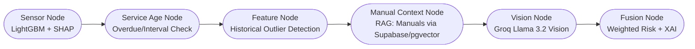

# Multi Modal Predictive Maintenance Agent

## Overview

This is an end-to-end asset-health agent designed for industrial centrifugal pumps. The system leverages multi-modal data—sensor readings, maintenance logs, technical manuals, and pump images—to deliver actionable, explainable health diagnostics and failure predictions.

---

## Problem Statement

Industrial pumps are critical assets in manufacturing and process industries. Unexpected failures lead to costly downtime and safety risks. This project aims to build a robust, explainable agent that predicts pump health and provides root-cause diagnostics by fusing:
- Real-time sensor data
- Maintenance/service history
- Technical manuals (retrieved via RAG)
- Visual inspection (image analysis)

---

## System Architecture

The core pipeline is orchestrated using a **LangGraph** linear flow, with each node responsible for a specific modality or fusion step:



### Node Descriptions

**sensor_node**: Runs a LightGBM model on real-time sensor data (temperature, vibration, pressure, flow, rpm) and uses SHAP for feature importance. Outputs a risk score and anomaly notes.

**service_age_node**: Checks if the pump is overdue for scheduled maintenance based on operational hours and service logs. Flags overdue assets and appends to the anomaly query.

**feature_node**: Detects historical outliers by comparing current sensor readings to baseline statistics from historical logs. Outputs risk impact and top signals.

**manual_context_node**: Retrieves relevant troubleshooting and warranty info from technical manuals stored in Supabase (using pgvector embeddings). Extraction and summarization are performed via external API calls.

**vision_node**: Sends pump images and manual context to an external vision API, which detects leaks, corrosion, cracks, and other visual faults. Appends findings to the anomaly query.

**fusion_node**: Combines all modality risk scores using configurable weights. Generates a final risk score, status label, top signals, action items, and a human-readable explanation.

---

## Installation & Usage

### Prerequisites
- Docker & Docker Compose
- Python 3.12+ (for local development)
- Supabase/Postgres instance (for manual/document storage)

### Quickstart (Docker)
```bash
git clone https://github.com/Murthypsty0419/Multi-Modal-Predictive-Maintenance-Agent
cd pump-health
docker-compose up --build
```
The API will be available at `http://localhost:8000` and the Streamlit frontend at `http://localhost:8501`.

### Manual Setup (Dev)
1. Create a Python virtual environment and install dependencies:
	```bash
	python -m venv .venv
	source .venv/bin/activate
	pip install -r requirements.txt
	```
2. Set up environment variables (see `.env.example`).
3. Start the API:
	```bash
	uvicorn app.api.routes:app --reload
	```
4. Start the frontend:
	```bash
	streamlit run frontend/app.py
	```

---

## Model & Component Details

- **Sensor Model**: LightGBM, trained on historical pump failure data. SHAP is used for explainability.
- **Text/Manual Context**: Manuals are chunked and stored in Supabase with pgvector. Retrieval and extraction are performed via external API calls.
- **Vision**: Images are analyzed by an external vision API, detecting leaks, corrosion, cracks, and other faults.
- **Fusion**: All risk scores are combined using a weighted sum. The fusion node outputs a final risk score, status label (low/medium/high/critical), top signals, action items, and a detailed explanation.

---

## Evaluation & Optimization

### Latency Bottleneck Analysis
- **Initial Bottleneck**: Early experiments with local large language models caused high latency (baseline inference ~45,369 ms).
- **Optimization**: Vision and text/manual analysis offloaded to external APIs, reducing local VRAM load and improving speed.

### Performance Metrics
- **p50 Latency**: ~42s
- **p95 Latency**: ~45.4s (cold start)
- **Throughput**: 1.32 pumps/minute

---

## Deliverables

- Full pipeline code (API, orchestrator, nodes, frontend)
- Dockerized deployment (docker-compose)
- Supabase schema for manual storage
- Model weights and config for LightGBM
- Example manuals and sensor logs
- Streamlit dashboard for interactive analysis
- Mermaid.js architecture diagram (see above)

---

## Production Deployment (Hosted Service)

To deploy this project as a hosted service (e.g., on a cloud VM, VPS, or managed container platform):

### 1. Prepare Your Environment
- Provision a Linux VM or container host (Ubuntu 22.04+ recommended).
- Install Docker and Docker Compose (or use Docker Compose V2 plugin).
- Set up DNS and firewall rules to expose ports 80/443 (for frontend) and 8000 (API) as needed.

### 2. Configure Environment Variables
- Copy `.env.example` to `.env` and fill in all required secrets and connection details (database, Supabase, API keys, etc).
- For production, use strong passwords and secure API keys.

### 3. Build and Start the Stack
```bash
# Clone the repository
git clone https://github.com/Murthypsty0419/Multi-Modal-Predictive-Maintenance-Agent
cd pump-health

# Build and start all services (API, frontend, database)
docker compose up --build -d
```
- The API will be available at `http://<your-server-ip>:8000`
- The Streamlit frontend will be available at `http://<your-server-ip>:8501`

### 4. (Optional) Reverse Proxy & TLS
- For HTTPS and custom domains, set up a reverse proxy (e.g., Nginx, Caddy, or Traefik) in front of the frontend and API containers.
- Terminate TLS at the proxy and forward requests to the appropriate container ports.

### 5. Database Persistence & Backups
- The PostgreSQL/pgvector database uses a Docker volume (`pgdata`) for persistent storage.
- Set up regular backups of this volume for disaster recovery.

### 6. Monitoring & Logs
- Use `docker compose logs -f` to monitor service logs.
- Consider integrating with cloud monitoring or log aggregation tools for production.

---

## Documentation

- See [AI_USAGE.md](./AI_USAGE.md) for details on how Gemini 3 Flash was used for architecture, debugging, and optimization.
- For API usage and schema, see [app/schemas.py](./app/schemas.py).
